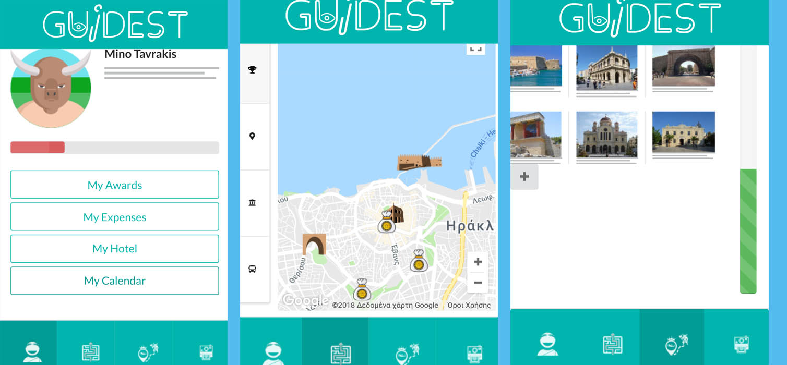

# GuiDest

## React application that use a gamification way to visiting points of interest via IBM cloud image recognition

_Creted for smartcity hackathon_

Demo of app is available [here](https://story.kantas.net/)

To test it locally run

`npm i`

`npm run`

and in different terminal run 

`node visualRecognition.js`